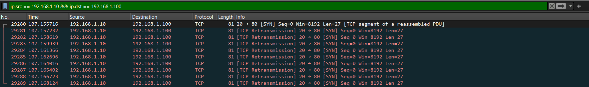

# Wireshark Analysis of Botnet Traffic

## C&C Communication
- The captured traffic shows communication attempts between bot IP `192.168.1.10` and C&C server IP `192.168.1.100`.
- The communication occurs over **TCP port 80**, which mimics standard HTTP traffic.
- The bot repeatedly sends **TCP SYN** packets to the server, attempting to establish a connection.

## Traffic Patterns Observed
- **TCP SYN Retransmissions**: The packets include multiple retransmissions, which suggest that the C&C server is not responding, and the bot is persistently trying to establish a connection.
- **Rapid Connection Attempts**: The packets are sent within very short intervals (less than 1 second apart), simulating aggressive connection attempts, possibly indicative of an attack scenario or failed C&C communication.

## Detailed Packet Breakdown
| Packet No | Time (s)  | Source IP    | Destination IP  | Protocol | Info                      |
|-----------|------------|--------------|-----------------|----------|---------------------------|
| 29280     | 107.155716 | 192.168.1.10 | 192.168.1.100   | TCP      | 20 → 80 [SYN]             |
| 29281     | 107.157232 | 192.168.1.10 | 192.168.1.100   | TCP      | [TCP Retransmission] SYN   |
| 29282     | 107.158619 | 192.168.1.10 | 192.168.1.100   | TCP      | [TCP Retransmission] SYN   |
| 29283     | 107.159939 | 192.168.1.10 | 192.168.1.100   | TCP      | [TCP Retransmission] SYN   |
| 29284     | 107.161366 | 192.168.1.10 | 192.168.1.100   | TCP      | [TCP Retransmission] SYN   |
| 29285     | 107.162696 | 192.168.1.10 | 192.168.1.100   | TCP      | [TCP Retransmission] SYN   |
| 29286     | 107.164016 | 192.168.1.10 | 192.168.1.100   | TCP      | [TCP Retransmission] SYN   |
| 29287     | 107.165402 | 192.168.1.10 | 192.168.1.100   | TCP      | [TCP Retransmission] SYN   |
| 29288     | 107.166723 | 192.168.1.10 | 192.168.1.100   | TCP      | [TCP Retransmission] SYN   |
| 29289     | 107.168124 | 192.168.1.10 | 192.168.1.100   | TCP      | [TCP Retransmission] SYN   |

## Conclusion
- The captured traffic highlights persistent botnet behavior, where the bot continues to attempt connections to the C&C server even after multiple failed attempts.
- These communication patterns can be flagged for detection as they show frequent TCP SYN retransmissions, which could be indicative of failed botnet C&C communication.

## Screenshots
- 