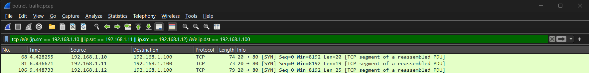
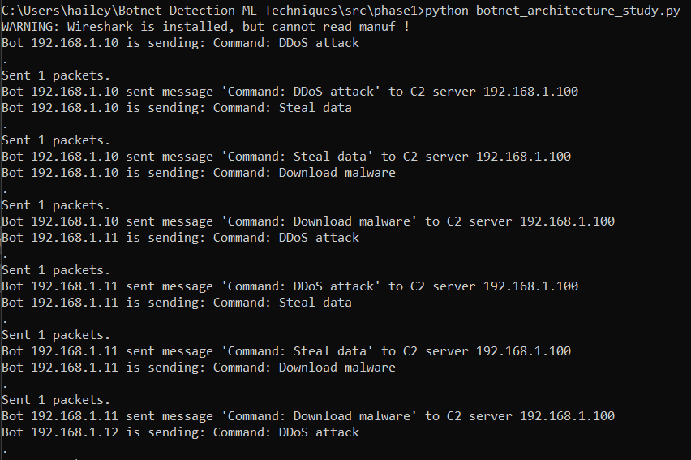
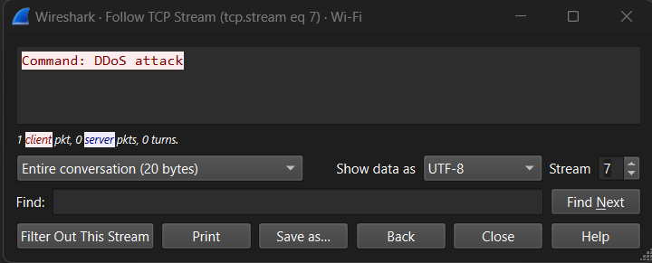
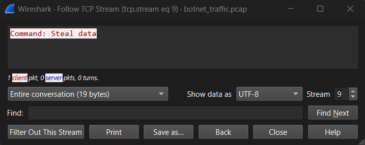
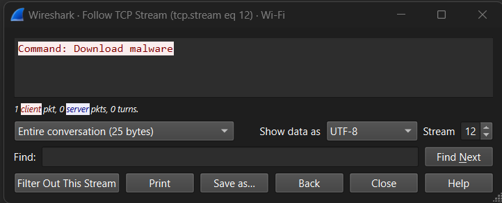

# Wireshark Analysis

## Overview
During Phase 1 of the botnet architecture simulation, we captured and analyzed the Command and Control (C2) communication between the botnet devices (`192.168.1.10`, `192.168.1.11`, `192.168.1.12`) and the C2 server (`192.168.1.100`). The botnets communicated using **TCP over port 80**, with each bot sending specific commands, such as DDoS attacks, data theft, and malware downloads.

This analysis focuses on understanding the traffic patterns, payloads, and the network behavior observed during the simulation.

---

## C&C Communication Patterns Observed
The communication between the bots and the C2 server followed a predictable pattern:
1. **Bot Initiation**: Each bot initiated the TCP communication by sending a **SYN** packet to the C2 server.
2. **Command Transmission**: After the connection was established, each bot transmitted its specific command payload. These commands were transmitted over TCP, ensuring reliable delivery.

### Observed Traffic Patterns:
- **Sequential Command Delivery**: Each bot sent commands in a sequential order with a slight random delay between transmissions to simulate varying traffic patterns.
- **TCP Packet Reassembly**: The commands were transmitted in fragmented TCP segments, which Wireshark reassembled into complete PDUs (Protocol Data Units).
- **Payload Variability**: Each bot transmitted a unique command (`DDoS attack`, `Steal data`, `Download malware`), which was clearly visible in the payload analysis of each TCP stream.

---

## Detailed Packet Breakdown
The following table shows a detailed breakdown of key TCP segments captured in Wireshark, illustrating how the bots initiated the communication and transmitted their payloads to the C2 server.

| Packet No. | Time      | Source       | Destination  | Protocol | Length | Info                                             |
|------------|-----------|--------------|--------------|----------|--------|--------------------------------------------------|
| 68         | 4.428255  | 192.168.1.10 | 192.168.1.100| TCP      | 74     | 20 → 80 [SYN] Seq=0 Win=8192 Len=20 [TCP segment of a reassembled PDU] |
| 81         | 6.436671  | 192.168.1.11 | 192.168.1.100| TCP      | 73     | 20 → 80 [SYN] Seq=0 Win=8192 Len=19 [TCP segment of a reassembled PDU] |
| 106        | 9.448733  | 192.168.1.12 | 192.168.1.100| TCP      | 79     | 20 → 80 [SYN] Seq=0 Win=8192 Len=25 [TCP segment of a reassembled PDU] |

### Screenshot: TCP Segments

---

## Botnet Commands Captured
Each bot transmitted its own unique command to the C2 server. These commands were:
1. **Bot 192.168.1.10**: `Command: DDoS attack`
2. **Bot 192.168.1.11**: `Command: Steal data`
3. **Bot 192.168.1.12**: `Command: Download malware`

These commands were sent over TCP, providing reliable delivery, and were reassembled in Wireshark for further analysis.

### Screenshot: Bot Commands Log

---

## Detailed Stream Analysis
Wireshark’s **Follow TCP Stream** feature was used to capture and analyze the individual conversations between the bots and the C2 server. Below are the results of the analysis for each bot:

### Stream 7: Bot 192.168.1.10 - Command: DDoS attack
This stream captured the communication between **Bot 192.168.1.10** and the C2 server. The payload carried the command to initiate a Distributed Denial of Service (DDoS) attack.

#### Screenshot:

---

### Stream 9: Bot 192.168.1.11 - Command: Steal data
This stream showed **Bot 192.168.1.11** sending the `Steal data` command to the C2 server. The command is clearly visible in the payload, indicating that the bot is executing a data exfiltration task.

#### Screenshot:

---

### Stream 12: Bot 192.168.1.12 - Command: Download malware
In this stream, **Bot 192.168.1.12** issued the `Download malware` command to the C2 server, indicating that it is attempting to retrieve and install malicious software.

#### Screenshot:

---

## Command & Control (C&C) Communication Analysis
### Traffic Flow:
- Each bot initiated communication by sending a **SYN** packet to establish a TCP connection with the C2 server.
- Once the connection was established, the bots transmitted their respective commands, which were reassembled as full PDUs by Wireshark.

### Key Observations:
1. **TCP Reliability**: The choice of TCP for communication ensured that the bot commands were delivered reliably, without packet loss or corruption.
2. **Separation of Commands**: Each bot sent a distinct command, and the traffic was cleanly separated by Wireshark using its TCP stream reassembly feature.
3. **Payload Delivery**: The payload size varied depending on the command, with the **DDoS attack** command being slightly smaller than the **Download malware** command.

---

## Conclusion
The Wireshark analysis confirms the successful transmission of botnet commands (`DDoS attack`, `Steal data`, `Download malware`) from the bots to the C2 server using TCP. The traffic was clearly visible and reassembled into complete payloads for analysis. This foundational analysis provides a solid understanding of how C&C traffic behaves and how detection mechanisms could potentially identify and mitigate such attacks based on traffic patterns and payload content.

---

